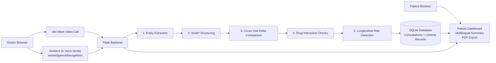

# Apex Health — Lifetime Medical Intelligence Platform

> Native telemedicine, ambient AI scribing, longitudinal intelligence, and multilingual patient access in one Flask app.
> Built for the India AI Summit Hackathon.

## ✨ Key Features

- 🩺 Native Telemedicine Integration: Jitsi Meet video calling launches dynamically from a patient's 14-digit ABHA ID.
- 🎙️ Ambient AI Voice Scribe: Browser-based `webkitSpeechRecognition` lets doctors dictate naturally while the notes are typed live.
- 🧠 5-Stage AI Intelligence Pipeline: Entity extraction, SOAP structuring, cross-visit delta comparison, drug interaction checks, and longitudinal risk detection.
- 🌐 Multilingual Patient Access: AI-generated patient-friendly summaries in Hindi, Tamil, Telugu, Bengali, and Marathi.
- 💾 Offline-Resilient Data Entry: `localStorage` autosave protects notes during weak connectivity or refreshes.
- 📄 Exportable Summaries: Patient-friendly views can be exported as PDF for sharing and review.

## Problem Statement

Telemedicine often creates fragmented records: one visit, one note, one platform, and no clean way to compare changes over time. Doctors need a fast, reliable way to capture clinical notes, view prior history, flag risks early, and communicate the result to patients in a language they understand.

## Our Solution

Apex Health turns each consultation into a structured longitudinal medical record.

Doctors can:

- open a video consultation directly from a patient's ABHA ID,
- dictate clinical notes while the AI scribe types in the background,
- automatically generate structured SOAP output,
- compare the current visit with prior visits,
- surface medication and risk insights, and
- hand the patient a simplified summary in their preferred language.

## Architecture Diagram



## Tech Stack

- 🐍 Backend: Flask, Python
- 🗃️ Database: SQLite
- 🤖 AI Pipeline: Multi-step LLM orchestration in `ai_pipeline.py`
- 🎥 Video Calling: Jitsi Meet External API
- 🎤 Speech Recognition: Browser-native `webkitSpeechRecognition`
- 🌍 Frontend: HTML, CSS, vanilla JavaScript
- 📦 PDF Export: `html2pdf.js`

## How It Works

1. Doctor logs in and opens a patient's teleconsultation using ABHA.
2. Jitsi starts the video call in the browser.
3. The AI scribe listens and types notes into the consultation form.
4. On submit, the backend runs the 5-stage AI pipeline.
5. Results are stored in SQLite and shown on the patient dashboard.
6. The summary is translated into a patient-friendly language and can be exported as PDF.

## How to Run Locally

```bash
# 1. Install dependencies
pip install -r requirements.txt

# 2. Initialize the database
python database.py

# 3. Seed richer demo visits, if you want the full presentation dataset
python time_machine.py

# 4. Start the app
python app.py

# 5. Open locally
http://127.0.0.1:5000
```

## Demo Notes

- 🔒 Use `http://localhost:5000` or `http://127.0.0.1:5000` for microphone access during local testing.
- 🎤 The browser may ask for microphone permission twice: once for Jitsi and once for the AI Scribe.
- 🌐 For public deployment, HTTPS is required for reliable microphone and video access.

## Project Structure

```text
.
├── app.py
├── ai_pipeline.py
├── database.py
├── time_machine.py
├── requirements.txt
├── templates/
│   ├── index.html
│   ├── login.html
│   ├── register.html
│   ├── doctor.html
│   ├── doctor_profile.html
│   ├── patient.html
│   └── translated_summary.html
└── static/
    ├── images/
    └── lab_reports/
```

## Why This Stands Out

- It is not a single summarizer bolted onto a form.
- It keeps the consultation longitudinal across visits.
- It supports live voice input and live video in the same workflow.
- It helps both clinicians and patients, not just one side.

## API Key

The Gemini API key is currently configured in `ai_pipeline.py`. Replace it with your own key before demoing publicly.

```python
MY_API_KEY = "your-key-here"
```

Free tier: https://aistudio.google.com
